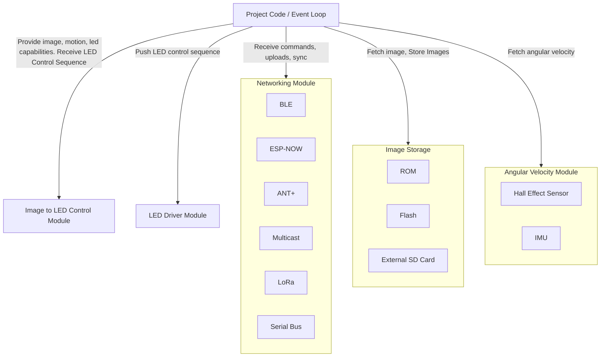

# Architecture
The project will utilize Espressif's esp-rs crates and libraries in order to drive an event loop and interface with hardware peripherals. It shall utilize the rust compiler fork provided by Espressif, which includes Xtensa support. Each subcomponent shall be use Traits to abstract away implementation details. For example, a networking component may a Channel that notifies listeners when a command message is received. The actual message may be provided by BLE, ESP-NOW, or a serial bus.

# High Level Components
* Networking Module: Handles receiving connection-less data to modify the device's state. This may allow a remote control of the current image/pattern, uploading new patterns/image, setting a time sync so multiple device display the same image. Possible backends include BLE, ESP-NOW, ANT+, multicast, Lora, etc.
* LED Driver Module: Abstracts the LED control component. A component shall expose the aspects of the hardware's capabilities. This shall include the number of strip elements, discrete light elements (LEDs) in a strip, and refresh rate of said LEDs. Callers shall be able to address and drive each individual element of LED hardware.
* Image Storage: This component retains the images and patterns that shall be displayed on the persistence of vision display. Square images will be stored, masked down to a circle to match the projected persistence of vision display. The storage shall be in ROM, flash, or an external SD card. A caller shall be able to query all images and fetch the bitmap representation of a given image. Depending on the supported storage backend, the caller shall be able to write new images to storage.
* Angular Velocity Module: This component shall provide the LED rig's current angular velocity. The hardware source shall be a Hall Effect Sensor, IMU, or other appropriate sensor.
* Image to LED Control Module: This component shall accept the an image and angular velocity. It shall translate these inputs into LED control sequences to create a persistence of vision display that appears to show the provided image.
* Project Code: This component shall glue together all other subcomponents. It will likely be an event loop that fetches data from sources such the angular velocity module and image storage, feeding their data into the led controller.

# Component Relationships
The following diagram shows how the major components interact, including modules that support multiple backend implementations.

