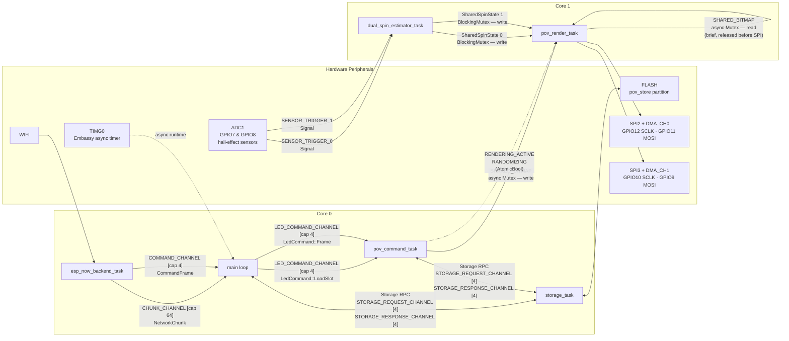

# `esp-spoke-firmware` Architecture

## Overview

`esp-spoke-firmware` is an Embassy-based async firmware for the ESP32-S3 spoke board in the POV
display system. The document describes the configuration in the 1.0 version hardware. Six concurrent Embassy tasks collaborate to:

1. **Receive images** over the air via ESP-NOW.
2. **Persist images** to flash slots with CRC32 verification.
3. **Estimate rotational position** of two spoke strips from dual hall-effect sensors monitored by
   the ADC1 threshold-comparator hardware. (TBD)
4. **Render POV frames** by driving two SK9822 LED strips over SPI, reading the correct radial
   slice of the polar bitmap at the angular position reported by each strip's spin estimator.

The firmware uses both ESP32-S3 cores. Core 0 hosts networking, storage, orchestration, and the
LED command task; core 1 hosts the render loop and spin estimation so time-sensitive display work
is isolated from the network and flash path.

The firmware is built around a message-passing architecture using Embassy channels, signals, and
mutexes. No task ever busy-polls another; all synchronisation is event-driven.

---

## Feature Configuration

This document assumes the following Cargo feature set:

| Feature          | Status      | Effect                                          |
|------------------|-------------|--------------------------------------------------|
| `espnow`         | ✓ Enabled   | ESP-NOW / WiFi networking backend                |
| `flash-4mb`      | ✓ Enabled   | 4 MB flash partition layout                      |
| `sk9822-strip`   | ✓ Enabled   | Dual SK9822 POV display + spin estimator         |
| `ble`            | — Disabled  | BLE extended-advertisement backend               |
| `usb-serial`     | — Disabled  | USB-JTAG COBS bridge backend                     |
| `waveshare-matrix` | — Disabled | WS2811 8×8 matrix backend                      |
| `mock-spin`      | — Disabled  | Time-based spin simulation (no hardware sensor)  |
| `heap-stats`     | — Disabled  | Periodic heap-stats logging task                 |
| `coexistence`    | — Disabled  | Simultaneous BLE + WiFi operation                |

---

## Component Diagram

The diagram below shows all six active Embassy tasks, the hardware peripherals each task owns, the
core they run on, and every inter-task communication channel or shared-state object.

### Communication Key

| Line style | Meaning |
|-----------|---------|
| Solid `-->` | Data channel or peripheral ownership |
| Dashed `-.->` | Atomic flag written by one task, polled by another |
| `<-->` | Bidirectional async RPC (request channel + response channel) |

---

## Module Descriptions

### Networking (`src/networking/`)

| File | Responsibility |
|------|----------------|
| `mod.rs` | Declares `CHUNK_CHANNEL` (cap 64) and `COMMAND_CHANNEL` (cap 4); initialises the WiFi stack in STA mode on channel 6; exposes `receive_chunk()` / `receive_command()` for the main loop |
| `esp_now.rs` | `esp_now_backend_task` — awaits `EspNow::receive_async()`, calls `ingest_espnow_payload()`, which reassembles `DownloadChunk` packets and routes them to `CHUNK_CHANNEL` or `CommandFrame` messages to `COMMAND_CHANNEL` |
| `download.rs` | Stateless packet ingestion: validates header, rebuilds `NetworkChunk` from raw payload bytes; enforces the 1448 B ESP-NOW payload limit |

**Key design choice:** All wireless backends are interchangeable. Each backend calls the same
`ingest_espnow_payload()` / `ingest_ble_payload()` entry points; the rest of the firmware has no
knowledge of the transport in use.

---

### Task Placement

- **Core 0**: `main` loop, networking backends, `storage_task`, and `pov_command_task`
- **Core 1**: `pov_render_task` and `dual_spin_estimator_task` (or `mock_dual_spin_estimator_task`)

### Orchestration — `main` loop (`src/bin/main.rs`)

The `main` async function is both the Embassy entry point and the transfer orchestrator. After
spawning all tasks it runs an infinite `select` loop over `CHUNK_CHANNEL` and `COMMAND_CHANNEL`:

- **On `CommandFrame`** — forwards the frame to `pov_command_task` via `LED_COMMAND_CHANNEL`.
- **On `NetworkChunk`** — drives the streaming flash-write state machine:
  1. New `transfer_id` → call `storage::begin_slot_write()` (RPC to `storage_task`).
  2. Each chunk → call `storage::write_slot_chunk()`.
  3. Final chunk (CRC verified) → call `storage::commit_slot()`, then send
     `LedCommand::LoadSlot(slot)` to `LED_COMMAND_CHANNEL`.
  4. New transfer while one is in progress → abort the previous slot first.

The `ActiveTransfer` struct tracks the current in-progress download (transfer ID, target slot,
expected CRC32, total byte count).

---

### Storage (`src/storage/`)

| File | Responsibility |
|------|----------------|
| `mod.rs` | `storage_task` + async RPC helpers; `STORAGE_REQUEST_CHANNEL` (cap 4) + `STORAGE_RESPONSE_CHANNEL` (cap 4) |
| `config.rs` | `SlotMetadata` (state, encoding, kind) stored in the ekv KV database; `ImageSlotState`: `Empty` / `Writing` / `Valid` |
| `image_file.rs` | Raw NOR(emulated) flash streaming API: `erase_for_streaming()`, `write_at_offset()`, `verify_crc()`. Chunk size: 3840 bytes |
| `ekv_flash.rs` | `EkvFlash` adapter bridging `esp-storage`'s `FlashStorage` to the `ekv` async flash trait |

**Async RPC pattern:** All callers (`main` and `pov_command_task`) send a `StorageRequest` variant
to `STORAGE_REQUEST_CHANNEL` and then await the matching `StorageResponse` on
`STORAGE_RESPONSE_CHANNEL`. The `storage_task` loop serialises all flash operations — no concurrent
flash access ever occurs.

**Two download slots (A/B):** Slot 0 and slot 1 alternate as the write target. The slot last
committed as `Valid` with the highest sequence number is loaded on boot. The other slot is erased
for the next download.

---

### LED Display (`src/led/`)

Two tasks share the display pipeline. Both are spawned on core 1:

#### `pov_render_task`

Runs a tight render loop:

1. Checks `RANDOMIZING` (AtomicBool). If set, fills both strips with random noise.
2. Checks `RENDERING_ACTIVE` (AtomicBool). If set:
   a. Locks `SHARED_BITMAP` (async Mutex) — reads the radial slice that corresponds to the
      current angular position from each strip's `SharedSpinState`.
   b. Releases the lock **before** calling `show()` — the SPI DMA transfer never holds the mutex.
   c. Calls `SPI2.show()` and `SPI3.show()` concurrently via `embassy_futures::join`.
3. If neither flag is set, yields for 1 ms to avoid a busy-loop.

The render task reads `SharedSpinState 0` for strip 0 and `SharedSpinState 1` for strip 1
independently, so the two strips can have different phase references.

#### `pov_command_task`

Blocks on `LED_COMMAND_CHANNEL` and handles:

| `LedCommand` variant | Action |
|----------------------|--------|
| `Frame(CommandFrame)` with `DisplayOff` | Clear both `RANDOMIZING` and `RENDERING_ACTIVE` |
| `Frame(CommandFrame)` with `RandomizeDisplay` | Set `RANDOMIZING = true` |
| `Frame(CommandFrame)` with `NextImage` | Cycle to the next flash slot or built-in image; decode into `SHARED_BITMAP`; set `RENDERING_ACTIVE = true` |
| `LoadSlot(n)` | Load flash slot `n`, decode into `SHARED_BITMAP`, set `RENDERING_ACTIVE = true` |

On boot, the command task attempts to restore the previously committed flash image before the
render loop is unblocked.

#### Shared bitmap (`SHARED_BITMAP`)

An `embassy_sync::mutex::Mutex` wrapping a heap-allocated `SwappingImageStorage`. The command task
holds the lock for the duration of an image decode; the render task holds it only for a
single-radial-slice copy. The mutex is **never** held during SPI transfers.

---

### Spin Estimation (`src/angles/`)

| File | Responsibility |
|------|----------------|
| `spin_estimator.rs` | `dual_spin_estimator_task`, `SharedSpinState`, `SENSOR_TRIGGER_0/1` signals, `PositionEstimator` integration |
| `adc_monitor.rs` | `AdcMonitor` — configures the ESP32-S3 APB_SARADC digital threshold comparators on ADC1 channels 0–7 (GPIO1–GPIO8); fires an interrupt that calls `SENSOR_TRIGGER_0.signal(())` or `SENSOR_TRIGGER_1.signal(())` |

#### `dual_spin_estimator_task`

Runs on a 1 ms timer tick. On each tick:

1. Checks `SENSOR_TRIGGER_0` and `SENSOR_TRIGGER_1` (non-blocking `try_take()`).
2. Steps two independent `PositionEstimator` instances, one per strip.
3. Writes the updated `SpinState` (angular position + velocity) into `SharedSpinState 0` and
   `SharedSpinState 1` via a `BlockingMutex<CriticalSectionRawMutex>`.

The `PositionEstimator` algorithm uses a phase-locked loop (PLL) style filter: it integrates
angular velocity between hall sensor triggers and snaps the phase on each trigger event.

**Hardware constraint:** The ADC threshold monitor can only address ADC1 channels 0–7
(GPIO1–GPIO8 on ESP32-S3). GPIO9 and GPIO10 are ADC1 pins but are not reachable by the comparator
hardware and must not be used for hall-effect sensing.

---

## Shared State

| Name | Type | Capacity | Element type | Producer → Consumer |
|------|------|----------|--------------|---------------------|
| `CHUNK_CHANNEL` | `Channel` | 64 | `NetworkChunk` | `esp_now_backend_task` → `main` |
| `COMMAND_CHANNEL` | `Channel` | 4 | `CommandFrame` | `esp_now_backend_task` → `main` |
| `LED_COMMAND_CHANNEL` | `Channel` | 4 | `LedCommand` | `main` → `pov_command_task` |
| `STORAGE_REQUEST_CHANNEL` | `Channel` | 4 | `StorageRequest` | `main` + `pov_command_task` → `storage_task` |
| `STORAGE_RESPONSE_CHANNEL` | `Channel` | 4 | `StorageResponse` | `storage_task` → `main` + `pov_command_task` |
| `SENSOR_TRIGGER_0` | `Signal<()>` | — | `()` | `AdcMonitor` ISR → `dual_spin_estimator_task` |
| `SENSOR_TRIGGER_1` | `Signal<()>` | — | `()` | `AdcMonitor` ISR → `dual_spin_estimator_task` |
| `SharedSpinState 0` | `BlockingMutex<RefCell<SpinState>>` | — | `SpinState` | `dual_spin_estimator_task` (write) → `pov_render_task` (read) |
| `SharedSpinState 1` | `BlockingMutex<RefCell<SpinState>>` | — | `SpinState` | `dual_spin_estimator_task` (write) → `pov_render_task` (read) |
| `SHARED_BITMAP` | `Mutex<BitmapStore>` | — | `SwappingImageStorage` | `pov_command_task` (write) ↔ `pov_render_task` (read) |
| `RENDERING_ACTIVE` | `AtomicBool` | — | `bool` | `pov_command_task` (write) → `pov_render_task` (poll) |
| `RANDOMIZING` | `AtomicBool` | — | `bool` | `pov_command_task` (write) → `pov_render_task` (poll) |

---

## Peripherals

| Peripheral | GPIO / Resource | Owning task | Purpose |
|-----------|----------------|-------------|---------|
| `WIFI` | — | `esp_now_backend_task` | WiFi STA mode; ESP-NOW receive on channel 6 |
| `FLASH` | pov_store partition | `storage_task` | NOR(emulated) flash image storage via ekv + `esp-storage` |
| `SPI2` + `DMA_CH0` | SCLK: GPIO12, MOSI: GPIO11 | `pov_render_task` (strip 0) | SK9822 LED strip 0 SPI output |
| `SPI3` + `DMA_CH1` | SCLK: GPIO10, MOSI: GPIO9 | `pov_render_task` (strip 1) | SK9822 LED strip 1 SPI output |
| `ADC1` (`APB_SARADC`) | GPIO1–GPIO8 | `AdcMonitor` ISR | Hall-effect threshold comparator; fires `SENSOR_TRIGGER_0/1` |
| `TIMG0` | — | Embassy runtime | Embassy async timer / scheduler tick |
